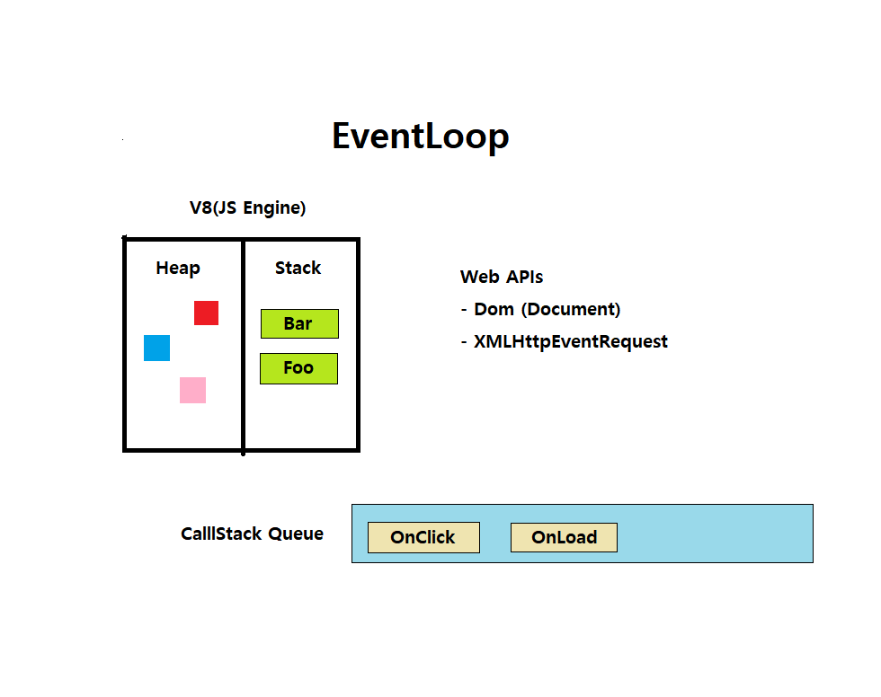

손수 그린 Event Loop 그림

<image src='../../public/images/EventLoop.png'/>

  

 

JavaScript는 싱글 스레드(single-threaded) 방식으로 동작 한다는데, 실동작은 여러작업이 동시다발적으로 일어나는 것으로 확인 된다.
이러한 역할에는 브라우저 및 런타임 환경에 내장되어 있는데 이벤트 루프가 큰 역할을 한다.

Stack: 함수의 호출들은 Frame(프레임) Stack을 형성 한다.  
소스 코드 평가 과정에서 생성된 실행 컨텍스트가 추가되고 제거되는 스택  
Heap: 객체는 heap에 할당, 힙은 단순히 메모리의 큰(그리고 대부분 구조화되지 않은) 영역을 지칭한다.  
Queue: 메세지의 대기열을 사용할 때 사용하며, 메세지에는 처리하기 위한 함수가 연결한다. 즉, 콜스택의 요소인 실핸 컨텍스트가 참조되는 것들이 저장되어 있다는 말이다.  

함수 처리는 Stack이 빌 때까지 처리하며 이에 Queue에 메세지가 남아있으면 같은 방법으로 계속 진행 한다.

힙과 콜스택은 JS엔진에 포함되어 있는 것들이고, 보다시피 엔진은 그냥 요청된 task를 단순히 순차적으로 실행하는 역할을 한다, 하지만 브라우저나 런타임 환경에 추가적인 기능을 제공하고 있는데 이에 이벤트 roop와 이벤트 queue가 포함 되어 있다.
 

이해하기 쉽게 설명한 유투브 링크는 아래를 클릭👇
 

출처  
- [https://developer.mozilla.org/ko/docs/Web/JavaScript/EventLoop]()
- [https://seo-tory.tistory.com/68]()